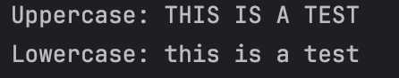

# Exploring Java `String` Methods
Submitted by: Baruc, Jana Enigma S.

### Exercise 1: `length()`  - Finding the String's Size
1. **Prediction**: `The length of the string is: 14`. 
   * This is because the total number of characters in the string given is **14**. This includes the comma, the space, and the exclamation point at the end of the string.
2. **Observation/Output**

### Exercise 2: `charAt()` - Accessing a Character
1. **Prediction**: `The charcter at index 5 is: l`
   * This is because `String` has a zero-based index system. It also counts a space as a character.
2. **Observation/Output**

### Exercise 3: `substring()` - Extracting a Part of a String
1. **Prediction**: `The extracted substring is: is`
   * This is because `String` extracts substring by using `.substring(beginIndex, endIndex -1)`.
2. **Observation/Output**

### Exercise 4: `toUpperCase()` and `toLowerCase()` - Changing Case
1. **Prediction**: `Uppercase: THIS IS A TEST`, `Lowercase: this is a test`
   * This is because `toUpperCase()` changes the case of the string to uppercase and  `toLowerCase()` changes it to lower case. Since they are stored in two new different objects, the case of the new strings will follow the case as the method directs.
2. **Observation/Output**

### Exercise 5: `indexOf()` - Finding a Character or Substring
1. **Prediction**: `Index of 'fox': 16`, `Index of 'z': 37`, `Index of 'cat': -1`
   * This is because `indexOf()` returns the index of the character being searched. It returns `-1` when it is not found.
2. **Observation/Output**

### Exercise 6: `equals()` vs. `equalsIgnoreCase()` - Comparing Strings
1. **Prediction**: `"Java".equals("java"): false`, `"Java".equals("Java"): true`, `"Java".equalsIgnoreCase("java"): true`
   * The first statement will print `false` because "Java" and "java" have different cases. The second statement prints `true` because both strings now have the same case. The third statement prints `true` even when they're different case because it now ignores the case.
2. **Observation/Output**

